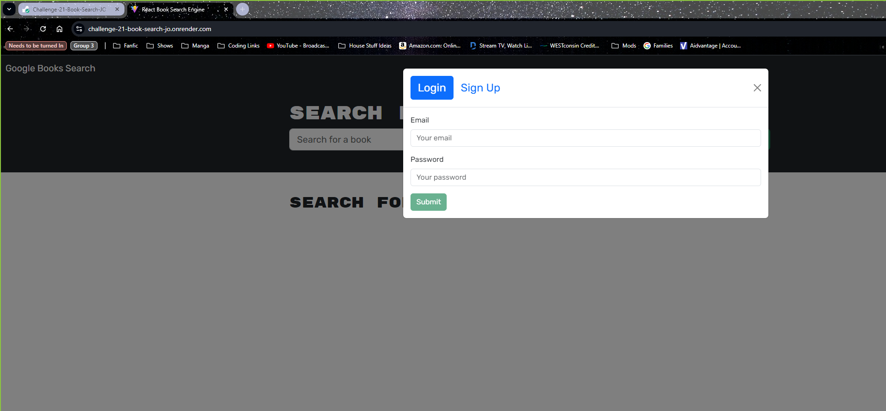
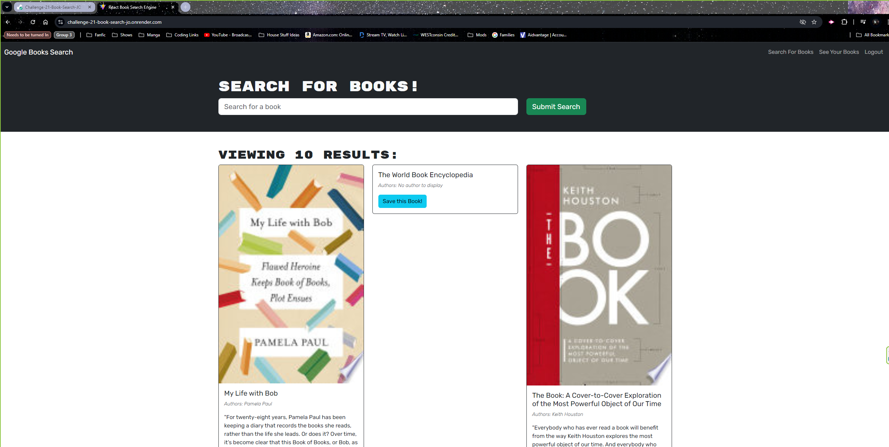
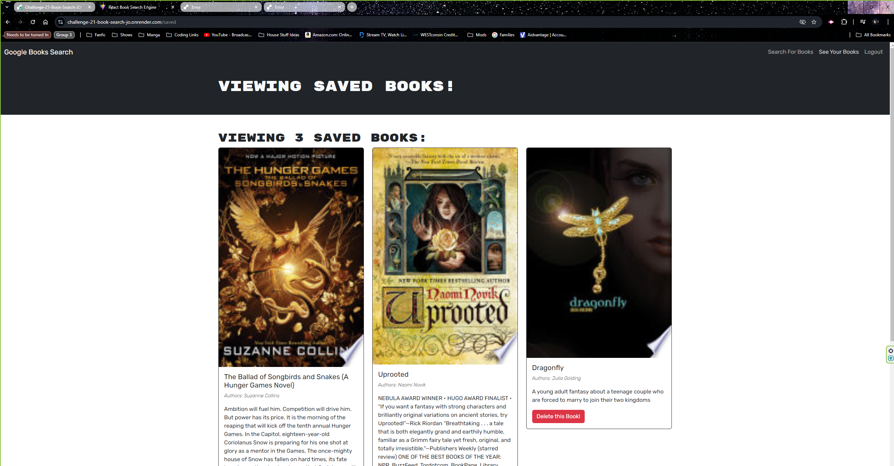

# Challenge-21-Book-Search-JO
This is Jaci Obeidzinski's Challenge for Module 21. This is a website that will search books by their name and allow you to save them to a favorites page. 

## How to Use 
You simply need to go to the rendered page and will be greated by the home page. On the home page you can search books but you are unable to save any books until you login or sign-up on the site. Once you login/sign-up you can save books and look at the list of saved books as well as remove books from the saved book page. You can even log out and some back later and once you log in your saved books will still be there!

## Source Code
This repository was made using source code that can be found on GitHub under the name [solid-broccoli](https://github.com/coding-boot-camp/solid-broccoli)

## License
MIT license

## Special Thanks
Thank you to everyone in my class for participating in class allowing me to learn more. 
Thank you to my instructor Chris Woolcott and the Teaching Assistant Steven Castro-Mercado. 

## Screen Shots

Here are screen shots of different pages on the [render page](https://challenge-21-book-search-jo.onrender.com/)

## Render Page 
[Here is the link to the render page for this code](https://challenge-21-book-search-jo.onrender.com/)

## Questions 
If you have any questions contact me at my GitHub @JaciObeid
or email me at jobeidzinski2@gmail.com